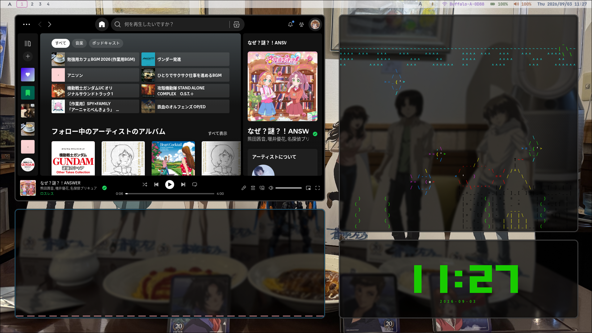
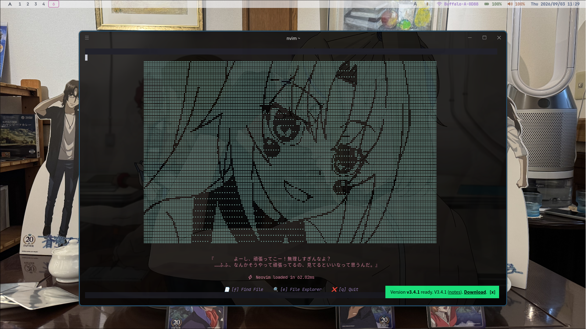
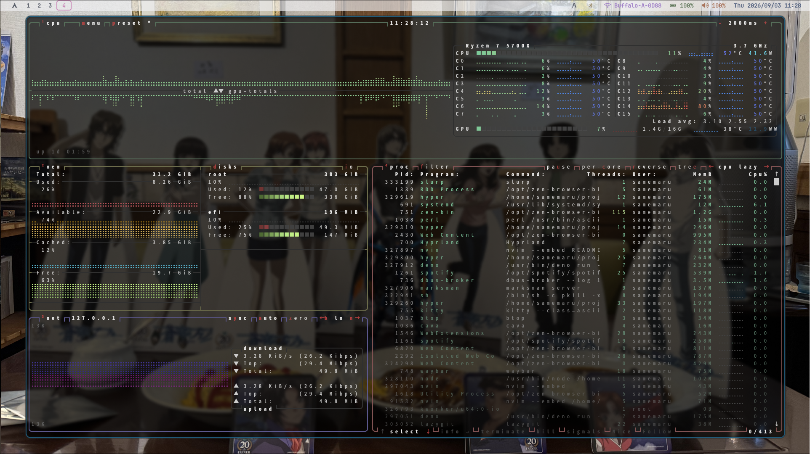
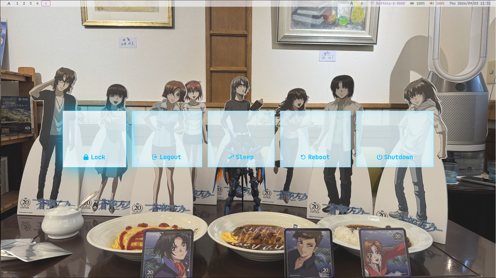

# dotfiles

###### 🇯🇵 日本語 | 🇺🇸 [English](./README.en.md)

### 最高の生活空間

#### ― btw, I use Arch (and Hyprland, and Neovim, and...)


<!-- TODO: ビデオ-->

<p align="center">
    
    
    
    
</p>

## 🛠️ 使用ツール

### Arch + WSL (共通)

- dotfiles管理: [chezmoi](https://www.chezmoi.io/)
- エディタ: [Neovim](https://neovim.io/)
    - 👉 Neovimの最強configは[コチラ](https://github.com/Samemaru07/nvim-config.git)
- ターミナルエミュレータ: [Hyper](https://hyper.is/)
    - 👉 Webview + SKK + 背景画像を組み込んだカスタムHyper: [Hyper-webview](https://github.com/Samemaru07/hyper-webview-fork)
- シェル: [fish](https://fishshell.com/)
- リソースモニター: [btop](https://github.com/aristocratos/btop)
- バージョン管理: [Git](https://git-scm.com/)
    - 👉 ツール: [lazygit](https://github.com/jesseduffield/lazygit) / [GitHub CLI (gh)](https://cli.github.com/)

### Arch Linux専用

- ウィンドウマネージャ: [Hyprland](https://hypr.land/)
- ステータスバー: [Waybar](https://github.com/Alexays/Waybar)
- ランチャー: [wofi](https://hg.sr.ht/~scoopta/wofi)
- ログアウトメニュー: [wlogout](https://github.com/ArtsyMacaw/wlogout)
- ディスプレイマネージャ: [SDDM](https://github.com/sddm/sddm/)
- 日本語入力: [fcitx5](https://fcitx-im.org/wiki/Fcitx_5) + [fcitx5-skk](https://github.com/fcitx/fcitx5-skk)
- ネットワーク管理: [NetworkManager](https://networkmanager.dev/)
- 通知: [SwayNotificationCenter](https://github.com/ErikReider/SwayNotificationCenter)
- オーディオビジュアライザ: [cava](https://github.com/karlstav/cava)
- カーソル: [フェルン (葬送のフリーレン) のカーソル (FernCursor)](https://www.opendesktop.org/p/2352161/)

### WSL専用

- クリップボード: [win32yank](https://github.com/equalsraf/win32yank)

## 📁 ディレクトリ構成

chezmoiによって管理されているリポジトリ (`~/.local/share/chezmoi`) の構成です。

```text
dotfiles/
    ├ Pictures/Wallpapers/           # 壁紙画像
    ├ assets/                        # README用画像素材
    ├ dot_config/                    # ~/.config/ 以下の設定ファイル群
    │  ├ cava/                       # オーディオビジュアライザ設定
    │  ├ gh/                         # GitHub CLI設定
    │  ├ hypr/                       # Hyprland / hypridle / hyprpaper設定
    │  ├ kitty/                      # Kittyターミナル設定
    │  ├ private_Hyper/              # Hyperターミナル設定 (OS別パス分岐テンプレート)
    │  ├ private_fcitx5/             # 日本語入力設定 (fcitx5 + SKK)
    │  ├ private_fish/               # fishシェル設定
    │  ├ quickshell/                 # quickshellウィジェット設定
    │  ├ swaync/                     # SwayNotificationCenter設定
    │  ├ systemd/user/               # systemdユーザーサービス (OpenRGBスリープ復帰用)
    │  ├ waybar/                     # Waybar設定
    │  ├ wlogout/                    # ログアウトメニュー設定
    │  └ wofi/                       # wofiランチャー設定
    ├ private_dot_ssh/               # SSHクライアント設定 (.ssh/config)
    ├ dot_gitconfig                  # Gitグローバル設定 (.gitconfig)
    ├ dot_tmux.conf                  # tmux設定 (.tmux.conf)
    ├ run_after_update-hyper.sh.tmpl # Hyper設定をWindows側へコピーする自動化スクリプト
    └ run_once_after_gh-login.sh     # GitHub CLIの初回ログイン自動化スクリプト
```

## 🚀 インストール

<details>
<summary>WSL (Ubuntu)</summary>

#### 0. 事前準備 (Windows)

##### Ubuntuのインストール

```bash
# PowerShell
wsl --install -d Ubuntu
```

#### 1. 必須パッケージのインストール

chezmoiの実行に必要なツールと、クリップボード連携ツール ([win32yank](https://github.com/equalsraf/win32yank))をインストールします。

```bash
sudo apt update
sudo apt install -y git curl fish gh unzip

# win32yankのインストール
mkdir -p ~/.local/bin
curl -sLo /tmp/win32yank.zip https://github.com/equalsraf/win32yank/releases/latest/download/win32yank-x64.zip
unzip -p /tmp/win32yank.zip win32yank.exe > ~/.local/bin/win32yank.exe
chmod +x ~/.local/bin/win32yank.exe
rm /tmp/win32yank.zip
```

#### 2. dotfilesの適用

以下のワンライナーを実行するだけで、リポジトリのクローンからファイルの配置、Windows側への同期スクリプトまでが全て自動で実行されます。

```bash
sh -c "$(curl -fsLS get.chezmoi.io)" -- init --apply Samemaru07
```

> 📌 **Note**: 途中でGitHub CLI (`gh`) のログインプロンプトが表示されます。画面の指示に従ってブラウザ認証などを進めてください。(この過程でSSH鍵の生成・登録も可能です)

#### 3. シェルの変更

```bash
chsh -s $(which fish)
```

#### 4. WSLの再起動

設定とデフォルトシェルを完全に反映させるため、WSLを再起動します。

```bash
# WSL
exit
# PowerShell
wsl --terminate Ubuntu
wsl -d Ubuntu
```

</details>

<details>
<summary>Arch Linux</summary>

#### 0. 事前準備

##### [Arch Linux](https://wiki.archlinux.org/title/Installation_guide)のインストール

##### [yay (AURヘルパー)](https://github.com/Jguer/yay)のインストール

```bash
sudo pacman -S --needed git base-devel
git clone https://aur.archlinux.org/yay.git
cd yay && makepkg -si
```

##### カーソルテーマの導入 (デフォルト「フェルン(FernCursor)」の場合)

- [FernCursor](https://www.opendesktop.org/p/2352161/)を `~/Downloads` にダウンロード。
- 以下のコマンドで直接 `~/.icons` に展開します。

```bash
mkdir -p ~/.icons
unzip -q ~/Downloads/FernCursor.zip -d ~/.icons
```

<details>

<summary><strong>他のテーマを使いたい場合</strong></summary>

1. [こちら](https://www.opendesktop.org/browse?cat=107&ord=latest)のサイトから好きなテーマを `~/Downloads` へダウンロード。
2. 以下のコマンドを実行して、テーマを配置

```bash
mkdir -p ~/.icons
unzip -q ~/Downloads/<テーマ>.zip -d ~/.icons
```

3. chezmoi経由で設定ファイルを編集し、テーマ名を書き換えます。

- `hyprland.conf` の編集

```bash
chezmoi edit ~/.config/hypr/hyprland.conf
```

```diff
- env = XCURSOR_THEME,FernCursor
+ env = XCURSOR_THEME,<テーマ名>
```

</details>

#### 1. 必須パッケージのインストール

chezmoiの実行や設定反映に必要な基本ツールをインストールします。

```bash
sudo pacman -S --needed curl git fish github-cli
```

#### 2. dotfilesの適用

```bash
sh -c "$(curl -fsLS get.chezmoi.io)" -- init --apply Samemaru07
```

> 📌 **Note**: 途中でGitHub CLI (`gh`) のログインプロンプトが表示されます。画面の指示に従ってブラウザ認証などを進めてください。(この過程でSSH鍵の生成・登録も可能です)

#### 3. シェルの変更

```bash
chsh -s $(which fish)
```

</details>

## 💘 こだわりポイント

- chezmoiを用いたArch LinuxとWSL環境間でのシームレスなドットファイル管理と同期。

## 📄 ライセンス

MIT License © 2026 Samemaru07

詳細は [LICENSE](./LICENSE) を参照してください。

Arch Linux の設定は [ViegPhunt](https://github.com/ViegPhunt/Arch-Hyprland) さんの dotfiles をベースに改良しました。
ありがとうございます 🙏

---

### 🖼️ 画像の出典

画像の著作権は各権利者に帰属します。再配布・二次利用は禁止します。

| ファイル                                              | 出典                                                                                        |
| ----------------------------------------------------- | ------------------------------------------------------------------------------------------- |
| `Pictures/Wallpapers/fafner.png`                      | 「蒼穹のファフナー 20周年記念 尾道コラボ」イベントでの自撮り                                |
| `Pictures/Wallpapers/hala.png`                        | [機動戦士ガンダム 閃光のハサウェイ 公開記念PV](https://www.youtube.com/watch?v=Mlb4WaADW2s) |
| `dot_config/quickshell/qs-hyprview/assets/misato.jpg` | ヱヴァンゲリヲン新劇場版：破                                                                |
| `dot_config/wofi/sakura.jpg`                          | [@susuki_Mk2](https://x.com/susuki_Mk2/status/1373651612766502917)                          |
